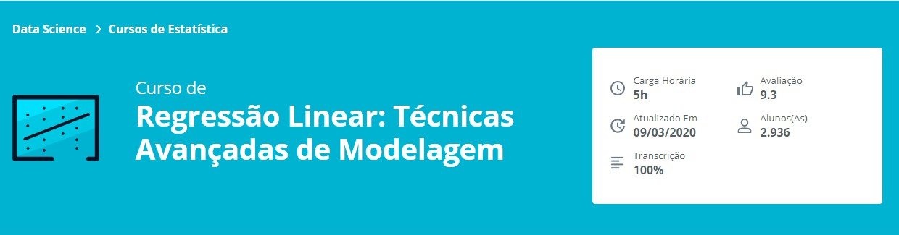

# data-science-modelo-regressao-linear-assimetria-statsmodel
Repositório de desenvolvimento referente ao Curso de Regressão Linear: Técnicas Avançadas de Modelagem - Alura

Repositório de desenvolvimento referente ao **Curso de Regressão Linear: Técnicas Avançadas de Modelagem - Alura**

## Aprendido no curso
* Aplique transformações antes de treinar seus modelos
* Aplique regressões com Statsmodel e Sklearn
* Aprenda técnicas Avançadas de Modelagem
* Obtenha previsões pontuais
* Interprete coeficientes estimados
* Efetue análises gráficas dos resultados encontrados

## Link para o Curso 
https://cursos.alura.com.br/course/data-science-modelo-regressao-linear-assimetria-statsmodel
